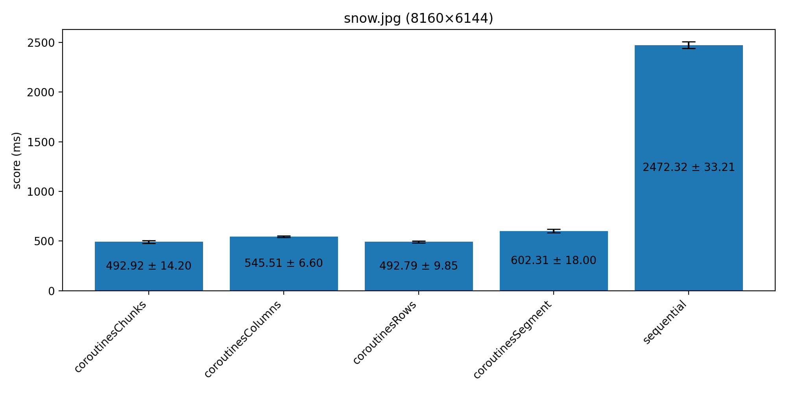
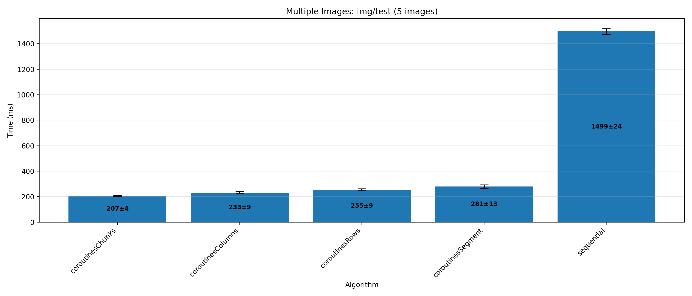

# Convolution

Приложение для применения фильтров свёртки ([convolution](https://lodev.org/cgtutor/filtering.html)) к изображениям с различными стратегиями параллельной обработки 

## Quick Start

Сборка проекта:
```bash
./gradlew build
```

### Commands

#### sequential
Последовательная обработка изображения
```bash
./gradlew run --args "sequential <filename> <filter>"
```
- `filename` - путь к изображению (требуется)
- `filter` - тип фильтра (требуется)

#### coroutines_rows
Параллельная обработка по строкам
```bash
./gradlew run --args "coroutines_rows <filename> <filter> [tasks]"
```
- `filename` - путь к изображению (требуется)
- `filter` - тип фильтра (требуется)
- `tasks` - количество потоков (опционально - по умолчанию по числу строк)

#### coroutines_columns
Параллельная обработка по столбцам
```bash
./gradlew run --args "coroutines_columns <filename> <filter> [tasks]"
```
- `filename` - путь к изображению (требуется)
- `filter` - тип фильтра (требуется)
- `tasks` - количество потоков (опционально - по умолчанию по числу столбцов)

#### coroutines_segment
Параллельная обработка сегментами
```bash
./gradlew run --args "coroutines_segment <filename> <filter> [tasks]"
```
- `filename` - путь к изображению (требуется)
- `filter` - тип фильтра (требуется)
- `tasks` - количество сегментов (опционально - по умолчанию 8 сегментов)

#### coroutines_chunks
Параллельная обработка 2D блоками
```bash
./gradlew run --args "coroutines_chunks <filename> <filter> [tasksX] [tasksY]"
```
- `filename` - путь к изображению (требуется)
- `filter` - тип фильтра (требуется)
- `tasksX` - число разбиения по горизонтали (опционально - по умолчанию 8)
- `tasksY` - количество блоков по вертикали (опционально - по умолчанию 8)

## Benchmarks
Эксперимент проводился на оборудовании:
* процессор: Intel Core i5-11400H (6C/12T)
* оперативная память: 16GB
* операционная система: Ubuntu 24.04

### Single Image: snow.jpg (8160×6144)



| Algorithm | Time (ms) | Error (ms) |
|-----------|-----------|-----------|
| coroutinesByPixel | 84608 | 3054 |
| coroutinesChunks | 552 | 10 |
| coroutinesColumns | 591 | 6 |
| coroutinesRows | 532 | 7 |
| coroutinesSegment | 641 | 15 |
| sequential | 2546 | 56 |

### Multiple Images: img/test (5 images)



| Algorithm | Time (ms) | Error (ms) |
|-----------|-----------|-----------|
| coroutinesByPixel | 26148 | 2232 |
| coroutinesChunks | 207 | 4 |
| coroutinesColumns | 233 | 9 |
| coroutinesRows | 255 | 9 |
| coroutinesSegment | 281 | 13 |
| sequential | 1499 | 24 |

## Conclusions

### Для единичного изображения:
- Наивная реализация распараллеливания по пикселям значительно медленнее остальных, 
что ожидаемо, так как накладные расходы на создание корутин начинают сильно 
превышать выигрыш от распараллеливания
- Прочие стратегии распараллеливания (по строкам, столбцам, сегментам и блокам)
показывают примерно схожую производительность, превосходя последовательную реализацию 
примерно в 4-5 раз, что оказывается вполне ожидаемым при использовании многоядерного 
процессора
- Стратегия распараллеливания по строкам оказывается чуть быстрее остальных, 
что может быть связано с лучшей локальностью данных (попаданий к кеш)
- Стратегия распараллеливания по блокам (2D-блокам) показывает несколько лучшую производительность, 
чем распараллеливание по сегментам (послдовательность пикселей). Это может быть связано с комбинированным
эффектом от локальность данных (попаданий к кеш) и эффективностью распределения нагрузки в корутинах
(по умолчанию изображение разбивается на 64 блока или 8 сегментов; соответственно более 
мелкие задачи более эффективно выполняются на корутинах (особенно учитывая их небольщие 
расходы на создание и переключение контекста)) 
### Для набора изображений:
- Для набора изображений справедливы выводы единичного изобрадения
- Распараллеливание ускорение обработки в 6-7 раз по сравнению с ускорением в 4-5 раз для единичного изображения
(_примечание_: измерения для единичного изображения не включают время на загрузку и сохранение изображения,
но поскольку это время можно считать за константу, то реальное относительное ускорение окажется даже меньше, 
если это время учитывать). Таким образом получается, что вынесение загрузки и сохранения изображения в отдельные 
корутины позволяет получить дополнительный выигрыш
- Распараллеливание по пикселям несет несет настолько большие накладные расходы на создание и переключение корутин,
что они нивелируют выигрыш от вынесение загрузки и сохранения изображений в отдельные корутины 


